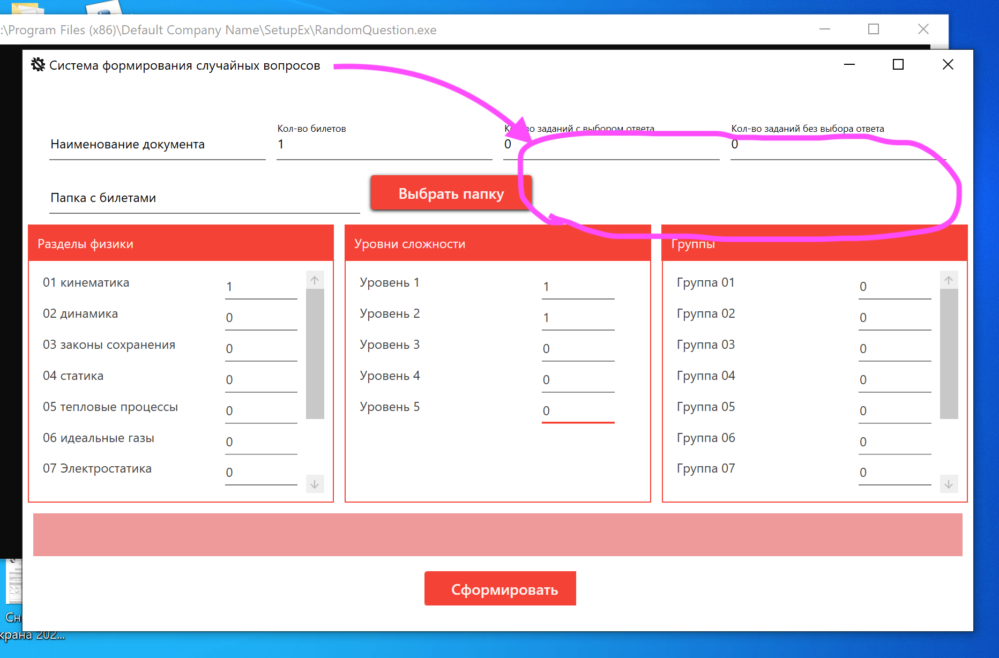

Ссылка на билеты и excel файл ответов:
(https://drive.google.com/drive/folders/1YCAC5u_TOC5muazFu5I_PDmJcoTCpbFF?usp=sharing)

#### P.S. было бы неплохо,если бы выбор задачи, раздела и тд, можно было бы ставить галочками, а не полем с 1 или 0, так как это не удобно и если это поле будет пустым, то там будет ошибка

### 1. Ворд файл должен заполняться по одному заданию

Когда мы установили значения программы, допустим, "кол-во билетов" в 4, "кол-во заданий с выбором ответа" в 6, "кол-во заданий без выбора ответа" в 4, то у нас в интефейсе должен выйти текст "Часть 1.Заполнение задачи номер 1", дальше мы должны выбрать раздел этой первой задачи, допустим кинематика, когда установим единичку(галочку) напротив раздела кинематика, то пользователь не должен иметь возможность выбрать еще задачу, потому что он уже поставил галочку напротив раздела кинематика, чтобы выбрать другой раздел, ему необходимо снять сначала галочку с уже установленного раздела кинематика. 

Далее после выбора сложности и группы задач, пользователь нажимает сформировать и у него выходит word файл в котором есть 4 билета, в каждом из которых есть одна задача по кинематике. Далее в программе текст сменяется с "Часть 1. Заполнение задачи номер 1" на "Часть 1.Заполнение задачи номер 2", где мы также выбираем раздел, сложность и группу задач, а дальше после нажатия на кнопку "сформировать", к уже имеющимся задачам номер 1 в word файле, должны добавиться задачи номер 2. Далее на смену текста "Часть 1.Заполнение задачи номер 2" приходит "Часть 1.Заполнение задачи номер 3" и далее идет тот же самый процес обновления билета, вплоть до задачи 6. А после добавления задачи 6, должен выйти текст "Часть 2.Заполнение задачи номер 1" где должно происходить тоже самое но с 4мя задачами без выбора ответа.

### 2. Когда мы выбрали раздел физики, то автоматически программа должна определять кол-во сложности и кол-во групп этой задачи.

Допустим пользователь поставил галку на раздел кинематика, в этот момент раздел сложность, должен автоматически вывести кол-во уровней сложности для этого раздела, а также кол-во групп сложности. 

### 3. Должна быть фозможность формировать word файл с ответами

Ответы к каждой задаче,можно найти в excel файле "название задачи+ответ_Фз.xlsx"

В интерфейс нужно добавить возможность выбора excel файла с ответами, его можно добавить вот здесь:

Образец файла с ответами:

